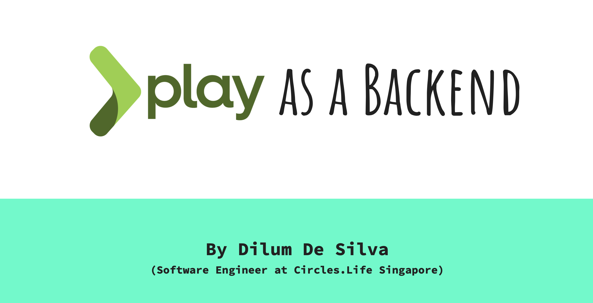

Play as backend is a series of 03 sessions that I have conducted for the second year students () of Informatics

## Week One

- Intro to ‘frontend vs backend’ concepts, technologies and opprtunities.
- Full-Stack development.
- Intro to Play as a backend.
- Combining Play with front end tech (concepts).
- What is MVC pattern / architecture.
- Play setup and base play project structure.

## Week Two

- What the heck is REST APIs?
- Concepts of REST APIs.
- Developing REST APIs with play (coding).
- Usage of tools like postman.

## Week Three

- Combining Play with a frontend (angular) and exposing an API ( coding ).

### For further knowledge

- [Play as Backend slide deck](https://docs.google.com/presentation/d/1qEIb2rs8oAuwzaC06-6q7nr3umtl5Dt661TAK9FEjbw/edit?usp=sharing)
- [Frontend vs Backend](https://www.youtube.com/watch?v=n_gODKYn9dM&feature=emb_logo)
- [Overview of Play Framework](https://www.playframework.com/documentation/2.8.x/Introduction)
- [MVC in 8 minutes](https://www.youtube.com/watch?v=FCkDEHWDATI&feature=emb_logo)
