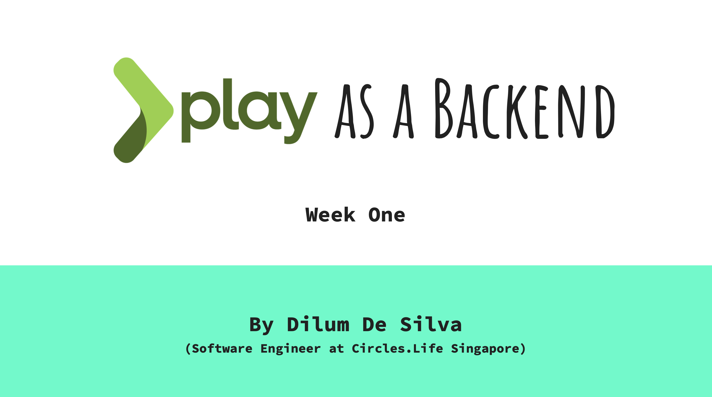

In the week one we will be disscusing content related to the following topics.

## Week One

- Intro to ‘frontend vs backend’ concepts, technologies and opprtunities.
- Full-Stack development.
- Intro to Play as a backend.
- Combining Play with front end tech (concepts).
- What is MVC pattern / architecture.
- Play setup and base play project structure.

### For further knowledge

- [Frontend vs Backend](https://www.youtube.com/watch?v=n_gODKYn9dM&feature=emb_logo)
- [Overview of Play Framework](https://www.playframework.com/documentation/2.8.x/Introduction)
- [MVC in 8 minutes](https://www.youtube.com/watch?v=FCkDEHWDATI&feature=emb_logo)
