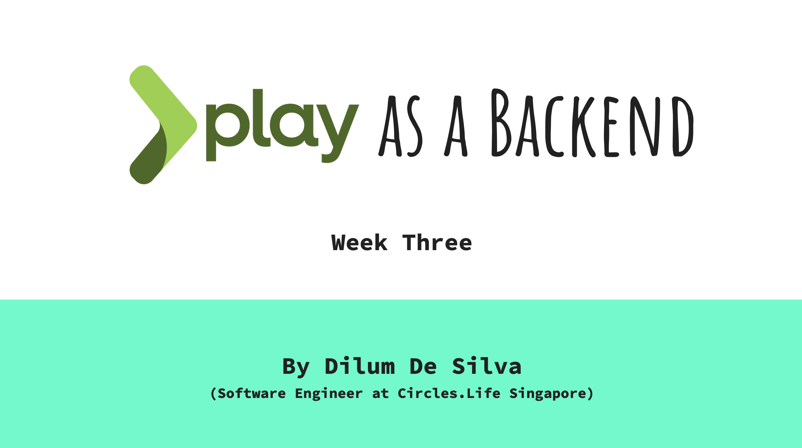

In the week three we will be disscusing content related to the following topics.

## Week Three

- Combining Play with a frontend (angular) and exposing an API ( coding ).
- Pros and Cons of cofigurations.

### For further knowledge

- [Running Frontend and Backend Dev Servers Together](https://vsupalov.com/combine-frontend-and-backend-development-servers/)
- [What are CORS?](https://developer.mozilla.org/en-US/docs/Web/HTTP/CORS)
- [Ahead-of-time (AOT) compilation](https://angular.io/guide/aot-compiler)
- [What are CDNs?](https://en.wikipedia.org/wiki/Content_delivery_network)
- [Reverse Proxy](https://en.wikipedia.org/wiki/Reverse_proxy)
- [npm scripts](https://docs.npmjs.com/cli/v6/using-npm/scripts)
