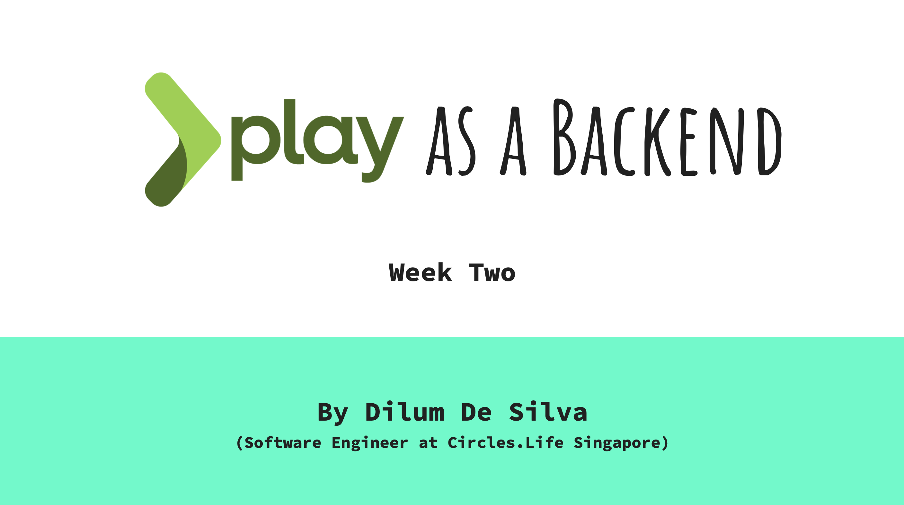

In the week two we will be disscusing content related to the following topics.

## Week Two

- What the heck is REST APIs?
- Concepts of REST APIs.
- Developing REST APIs with play (coding).
- Usage of tools like postman.

## Rest API Standards

### HTTP Methods

- GET
    - Fetch / read resource(s)
    - Path Params + Query Params
    - No body

- POST
    - Create new resource(s)
    - Path Params + request body

- PUT
    - Update existing resource - full update
    - Path Params + request body

- DELETE
    - Delete an existing resource - (for critical resources do soft delete)
    - No query params
    - No body

- PATCH
    - Modify existing resource - partial update
    - To make it idempotent and safe from race conditions,
        - either pass a last accessed timestamp, or
        - present values of the fields being updated as filters in the body for conditional partial update.
    - Path Params + request body

### [Read about HTTP Headers](https://developer.mozilla.org/en-US/docs/Web/HTTP/Headers)

### HTTP Status Codes And Error Messages
Some of the messages you’ve received earlier, like “Requires authentication” and “Problems parsing JSON” are error messages. They only appear when something is wrong with your request. HTTP status codes let you tell the status of the response quickly. The range from 100+ to 500+. In general, the numbers follow the following rules:
- 200+ means the request has succeeded.
- 300+ means the request is redirected to another URL
- 400+ means an error that originates from the client has occurred
- 500+ means an error that originates from the server has occurred

## For further knowledge

- [REST API concepts and examples](https://www.youtube.com/watch?v=7YcW25PHnAA&feature=emb_logo)
- [Free and public APIs](https://github.com/public-apis/public-apis)
- [A modern request bin to inspect any event](https://requestbin.com)

